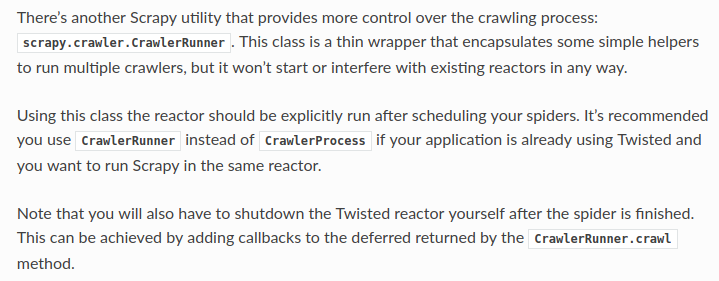

# Scrapy dots

1. scrapy是基于twisted的异步框架，主要利用回调来进行调度，线程级。scrapy自己提供Scheduler和Downloader，用户可以自定义，以重写一些中间件的方式，例如下载，代理等。
1. 官方文档说明crawler脚本启动可以通过CrawlerProcess和CrawlerRunner，前者会自动使用reactor，在同一个进程里使用同一个reactor，而若使用后者不会自动连接到reactor，需要手动启动，并添加Callback在爬虫结束后将其关闭

1. twisted的reactor为单例模式，一旦run则无法restart，除非程序退出  
    ```
    runner = CrawlerRunner(settings)
    for crawler in crawlers:
            runner.crawl(crawler)
            
    d = runner.join()
    d.addBoth(lambda _: reactor.stop())  # 结束和错误之后的回调
    reactor.run()  # the script will block here until all crawling jobs are finished
    ```
1. 由于scrapy基于twisted，并不能友好的支持gevent协程，无法由用户自由调度
1. scrapy默认的cookie中间件优先权是700，自定义的cookie中间件需设置成701+

# Target：最大程度提升爬虫性能

## 爬虫性能进阶（不针对Scrapy框架）

主要从多进程/多线程，可使用的相关模块有：
* threading
* multiprocessing
* [twisted](https://github.com/twisted/twisted)
* [gevent](https://github.com/gevent/gevent)
* [tornado](https://github.com/tornadoweb/tornado)

# Python单例模式
```
class Singleton(type):
    _instances = {}  
  
    def __call__(cls, *args, **kwargs):
        if cls not in cls._instances:
            cls._instances[cls] = super(Singleton, cls).__call__(*args, **kwargs)
        return cls._instances[cls]
```