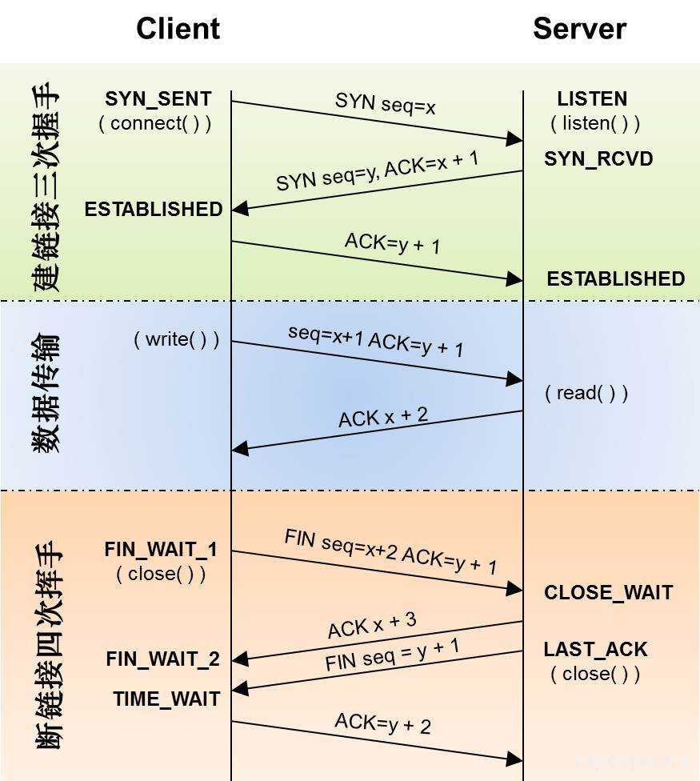

# Redis() 和 StrictRedis() 区别
    redis-py exposes two client classes that implement these commands  
    The StrictRedis class attempts to adhere to the official command syntax.
      
    In addition to the changes above, the Redis class, a subclass of StrictRedis,
    overrides several other commands to provide backwards compatibility with older
    versions of redis-py
    
也就是说StrictRedis类更接近原生redis，而Redis类实现的一些command会和原生redis有区别（参数会有不同）

# Redis Pipeline
pipeline是redis在提供单个请求中缓冲多条服务器命令的基类的子类。它通过减少服务器-客户端之间反复的TCP数据库包，从而大大提高了执行批量命令的功能

# 一些时间复杂度
[PYTHON内置方法的时间复杂度](http://www.orangecube.net/python-time-complexity)  
[常用数据结构的时间复杂度](http://blog.csdn.net/cloudybird/article/details/51206789)

# 浏览器的一个请求从发送到返回都经历了什么!
1、先从网络模型层面：

client （浏览器）与 server 通过 http 协议通讯，http 协议属于应用层协议，http 基于 tcp 协议，所以 client 与 server 主要通过 socket 进行通讯；

而 tcp 属于传输层协议、如果走 https 还需要会话层 TLS、SSL 等协议； 传输层之下网络层，这里主要是路由协议 OSPF 等进行路由转发之类的。再向下数据链路层主要是 ARP、RARP 协议完成 IP 和 Mac 地址互解析，再向下到最底层物理层基本就是 IEEE 802.X 等协议进行数据比特流转成高低电平的的一些定义等等；

当浏览器发出请求，首先进行数据封包，然后数据链路层解析 IP 与 mac 地址的映射，然后上层网路层进行路由查表路由，通过应用层 DNS 协议得到目标地址对应的 IP ，在这里进行 n 跳的路由寻路；而传输层 tcp 协议可以说下比较经典的三次握手、四次分手的过程和状态机，这里放个图可以作为参考：  

2、应用层方面：

数据交换主要通过 http 协议， http 协议是无状态协议，这里可以谈一谈 post、get 的区别以及 RESTFul 接口设计，然后可以讲服务器 server 模型 epoll、select 等，接着可以根据实际经验讲下 server 处理流程，比如我： server 这边 Nginx 拿到请求，进行一些验证，比如黑名单拦截之类的，然后 Nginx 直接处理静态资源请求，其他请求 Nginx 转发给后端服务器，这里我用 uWSGI, 他们之间通过 uwsgi 协议通讯，uWSGI 拿到请求，可以进行一些逻辑， 验证黑名单、判断爬虫等，根据 wsgi 标准，把拿到的 environs 参数扔给 Django ，Django 根据 wsgi 标准接收请求和 env， 然后开始 start_response ，先跑 Django 相关后台逻辑，Django 拿到请求执行 request middleware 内的相关逻辑，然后路由到相应 view 执行逻辑，出错执行 exception middleware 相关逻辑，接着 response 前执行 response middleware 逻辑，最后通过 wsgi 标准构造 response， 拿到需要返回的东西，设置一些 headers，或者 cookies 之类的，最后 finish_response 返回，再通过 uWSGI 给 Nginx ，Nginx 返回给浏览器。
